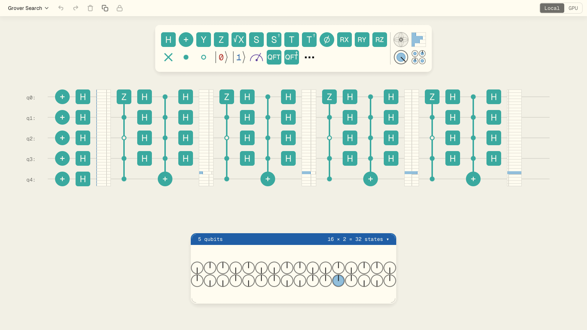
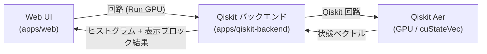

# qni-webgpu

ブラウザ上で動く **WebGPU ベースの量子回路 UI / シミュレーション環境**です。
Rust + egui で書いた回路エディタを WebAssembly として配信し、状態ベクトルや表示ブロックの計算を WebGPU compute shader 上で行います。

[Qni](https://github.com/qniapp/qni) (qni-gl, WebGL 系) の正式な後継プロジェクトで、状態シミュレーションを **GPU 上で完結させる構成** に刷新しています。



> 画面例: サンプル回路の Grover 探索。状態ベクトル表示で、解の確率振幅だけが大きくなる様子が確認できる。

## 機能

- **Web UI 上での量子回路編集** — ゲートパレットからのドラッグでゲートを配置できる。扱える量子ビット数はローカルの WebGPU シミュレーションで最大 16、外部 GPU (Qiskit) バックエンド利用時は最大 32
- **WebGPU による高速なローカルシミュレーション** — 状態ベクトル / 密度行列 / ブロッホベクトルなどの計算から可視化まで、すべて WebGPU compute shader 上で完結する。GPU → CPU のリードバックが無いため高速
- **表示ブロック** — 振幅 / 確率 / ブロッホ球 / 密度行列の各表示ブロックをサポート
- **オプション: 外部 GPU 実行 (Qiskit バックエンド)** — `Run GPU` から `apps/qiskit-backend` の HTTP API へ投げ、Qiskit Aer (cuStateVec) で実行できる
- **ABCI / Open OnDemand 配備の土台** — Docker / Singularity / Open OnDemand 用の定義を `deploy/` に同梱

## クイックスタート

ローカルで Web UI を起動する最短手順です。

### 1. Rust と Trunk を用意する

```bash
rustup target add wasm32-unknown-unknown
cargo install trunk --locked
```

### 2. 開発サーバを起動する

```bash
cd apps/web
trunk serve --address 127.0.0.1 --port 4174 --no-autoreload
```

### 3. Chrome でアクセスする

WebGPU 対応ブラウザ (Chrome / Chromium 系の最新版を推奨) で次を開きます。

```
http://127.0.0.1:4174/
```

リポジトリルートから `./scripts/open-web.sh` を使うと、`google-chrome-stable` を優先して開きます。

詳しい起動方法と環境変数は [`docs/web.md`](docs/web.md) を参照してください。

## 開発

主要なチェックはリポジトリルートからまとめて実行できます。

```bash
./scripts/check-all.sh
```

これは Trunk 本番ビルド、Web の BDD / Playwright テスト、Node の配備設定テスト、Qiskit バックエンドのスモークテスト、Rust の fmt / clippy / test / snapshot / audit / deny をまとめて流します。

個別に動かしたい場合の主なコマンド:

- **Web の BDD (Cucumber)**: `cd apps/web && pnpm install && pnpm run test:bdd`
- **Web の Playwright**: `cd apps/web && pnpm exec playwright install chromium && xvfb-run -a -s "-screen 0 1920x1080x24" pnpm exec playwright test`
- **ドキュメント lint**: `./scripts/lint-docs.sh` (用語ゆれ / HTML 構造 / Markdown スタイル)

詳細は [`docs/rust.md`](docs/rust.md) と [`docs/web.md`](docs/web.md) を参照してください。

## Qiskit バックエンド (任意)

`Run GPU` から呼び出す外部 GPU 実行用のローカルバックエンドです。Web UI は回路を送り、バックエンドはヒストグラムと表示ブロック単位の結果だけを返します。全状態ベクトルや全確率分布は転送しません。



ローカルで起動する最短手順:

```bash
PYTHONPATH=apps/qiskit-backend/src python3 -m qni_qiskit_backend --port 4184 --runner mock
```

ランナーは 3 種類あります。

- `mock` — 固定ヒストグラム / 固定表示ブロック結果を返す。UI と API のスモークテスト用。
- `qiskit-cpu-dev` — Qiskit 経路を CPU で確認するための **明示的な開発用ランナー**。WebGPU の CPU フォールバックではない。
- `qiskit-gpu` — `device="GPU"` / `cuStateVec_enable=True` を要求する本番相当のランナー。CPU フォールバックしない。

本番配備では `qiskit-gpu` だけを許可し、`mock` / `qiskit-cpu-dev` を要求するリクエストは拒否します。詳細は [`apps/qiskit-backend/README.md`](apps/qiskit-backend/README.md) を参照してください。

## デプロイ

ABCI の GPU ノードで動かすための Docker / Singularity / Open OnDemand 定義を `deploy/` に同梱しています。Open OnDemand 経由では `singularity run --nv` で GPU ノード上に起動し、`/node/<host>/<port>/` 配下で Web UI と `/run` API を提供します。

```bash
docker build -t qni-webgpu-abci .
docker run --gpus all --rm -p 8000:8000 \
  -e QNI_AUTH_USERNAME=userA \
  -e QNI_AUTH_PASSWORD=passA \
  qni-webgpu-abci
```

配備手順の詳細は次を参照してください。

- [`docs/implementation/abci-deployment-guide.md`](docs/implementation/abci-deployment-guide.md) — ABCI Open OnDemand 配備手順
- [`docs/implementation/external-gpu-api-compatibility.md`](docs/implementation/external-gpu-api-compatibility.md) — 外部 GPU API の互換方針
- [`docs/implementation/qni-gl-migration-notes.md`](docs/implementation/qni-gl-migration-notes.md) — qni-gl との差分

## ドキュメント

- [`docs/architecture.md`](docs/architecture.md) — WebGPU 版のアーキテクチャ概要
- [`docs/tech-stack.md`](docs/tech-stack.md) — 技術スタック (Rust / wgpu / egui / Trunk)
- [`docs/web.md`](docs/web.md) — Web アプリの起動・確認手順
- [`docs/rust.md`](docs/rust.md) — Rust 側のチェック手順
- [`docs/design.md`](docs/design.md) — UI 設計メモ
- [`apps/qiskit-backend/README.md`](apps/qiskit-backend/README.md) — Qiskit バックエンドの API 仕様

## 既知の制限

- **WebGPU 対応ブラウザが必要**: 主要ブラウザの最新版 (Chrome / Edge / Firefox / Safari) で動作する。ただし Firefox の Linux 安定版は WebGPU 未対応で、Nightly / Beta で `gfx.webgpu.ignore-blocklist` を有効にする必要がある (2026 年 5 月時点)。対応していない GPU / ドライバでも起動しない。
- **Qiskit バックエンドは別途用意**: `Run GPU` を使うには `apps/qiskit-backend` を別プロセスで起動する必要がある。本番 `qiskit-gpu` ランナーは CUDA / cuStateVec を要求する。
- **ABCI 配備は環境依存**: `deploy/` 配下の定義は ABCI 実機での検証が部分的であり、資源種別 / モジュール名は環境に合わせて調整する必要がある。
