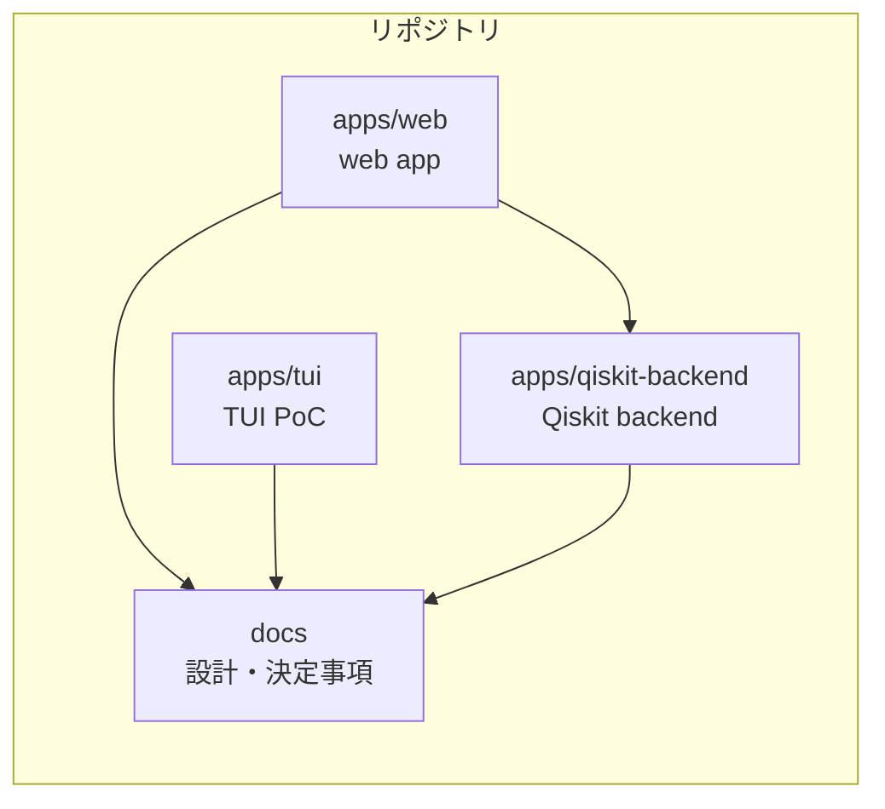
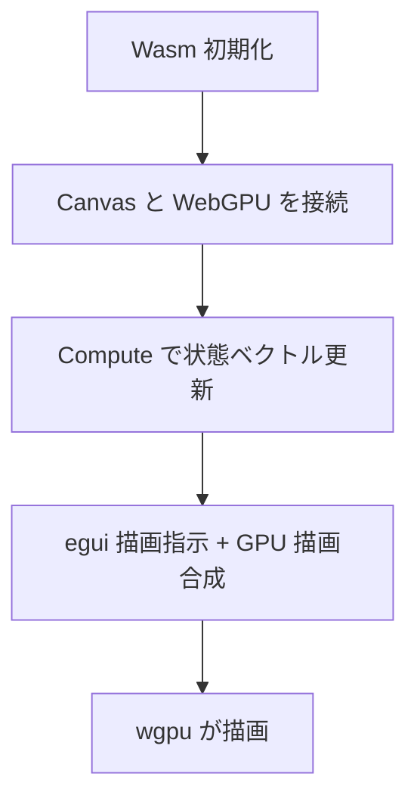
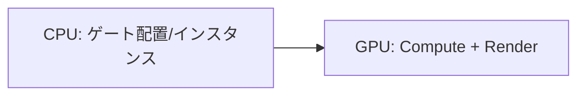
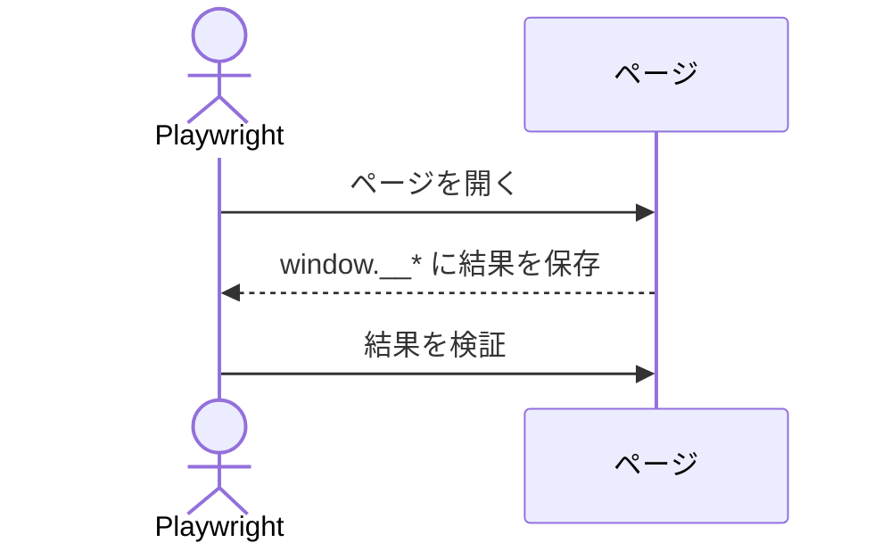

# アーキテクチャ概要（WebGPU 初心者向け）

このドキュメントは、WebGPU を初めて触る人でも流れが追えるように、PoC の全体像と描画の仕組みをやさしく説明する。専門用語は最小限にとどめ、要点を図で示す。

## 全体構成（何がどこにあるか）

- Monorepo 構成で、WebGPU PoC は `apps/web` に集約されている。
- 端末向けの最小 PoC は `apps/tui` に置き、Rust + ratatui で Web 版に触れずに動作確認できる。
- 外部 GPU 実行 API は `apps/qiskit-backend` に置き、Web UI の `Run GPU` から利用する。
- Web UI は Rust（egui/eframe）で構築し、Wasm として動く。
- Web PoC は起動時 2 量子ビットから始まるが、ドラッグ操作に応じて空のワイヤを追加し、最大 16 量子ビットまで扱う。
- Web のゲートパレットは `H/CTRL/X/Y/Z/√X/S/S†/T/T†/P/Rx/Ry/Rz/SWAP` を扱う。

## 画面構成（画面に何が出るか）

- `index.html` に `canvas#egui-canvas` を配置し、eframe が描画対象として使う。
- キャンバスはウィンドウサイズに合わせて全画面でリサイズする。
- 画面は「初期 2 本の量子ビット線（必要に応じて増える）」「上部のゲートパレット」「配置済みゲート」「状態ベクトルの円表示」で構成する。

## 描画の流れ（ざっくり）

egui/eframe が WebGPU の初期化と描画ループを担当する。ここでは大まかな流れだけ押さえる。

1. Wasm を初期化し、egui アプリを起動する  
2. eframe がキャンバスと WebGPU を接続する  
3. ゲート配置を更新し、WebGPU の Compute で状態ベクトルを更新する  
4. 状態ベクトルの円は GPU の Fragment で描画し、egui の描画指示と合成する  

## 描画モデル（CPU と GPU の役割分担）

- CPU（Wasm/Rust 側）は「ゲート配置」「インスタンス情報の構築」を担当する。
- GPU（WebGPU/wgpu 側）は「状態ベクトル計算（Compute）」「状態ベクトルの円描画（Fragment）」「egui の描画コマンド合成」を担当する。

## 量子計算の流れ（PoC としての最小構成）

- 起動時は `|00>` を初期状態として GPU バッファに書き込む。
- ゲートはパレットからドラッグしてワイヤへ配置する。
- 配置済みゲートを左から順に並べ、使用中のワイヤ数に応じた状態ベクトルへゲートを適用する。
- 計算は WebGPU の Compute で行い、結果は GPU バッファのまま描画に利用する。
- CPU への読み戻しは Playwright テスト時のみ行う。

## 描画ループ（動いているか確認する仕組み）

- eframe が描画ループを管理し、毎フレーム egui を描画する。

## テストの仕組み（Playwright）

- Playwright で「WebGPU が使えること」「ゲートのドラッグが動くこと」「状態ベクトルが期待値になること」を確認する。
- テストはヘッドレスがデフォルト（必要なら `HEADLESS=0` で可視化）。
- `window.__eguiReadStateVector`（Promise）と `window.__eguiReady` を使い、計算結果や初期化完了を確認する。
- テストで確認する項目は以下。
  - WebGPU が有効であること
  - キャンバスサイズが期待通りであること
  - 初期状態の状態ベクトルが `|00>` であること
  - ゲート配置後の状態ベクトルが期待値になること

## 主要ファイル

- `apps/web/src/lib.rs`: egui UI と GPU 状態ベクトル計算/描画
- `apps/web/index.html`: キャンバス配置と Trunk 設定
- `apps/web/bootstrap.ts`: Wasm 初期化とテスト用フック（Trunk hook で `bootstrap.js` を生成）
- `apps/web/tests/web.spec.ts`: Playwright テスト
- `docs/decisions.md`: PoC の仕様・決定事項
