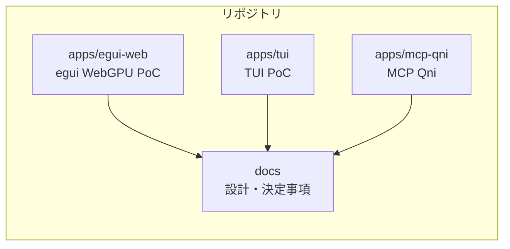
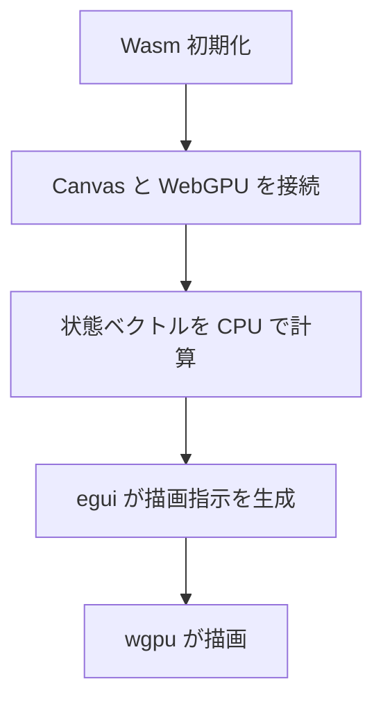
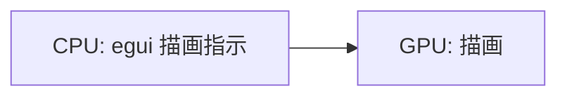
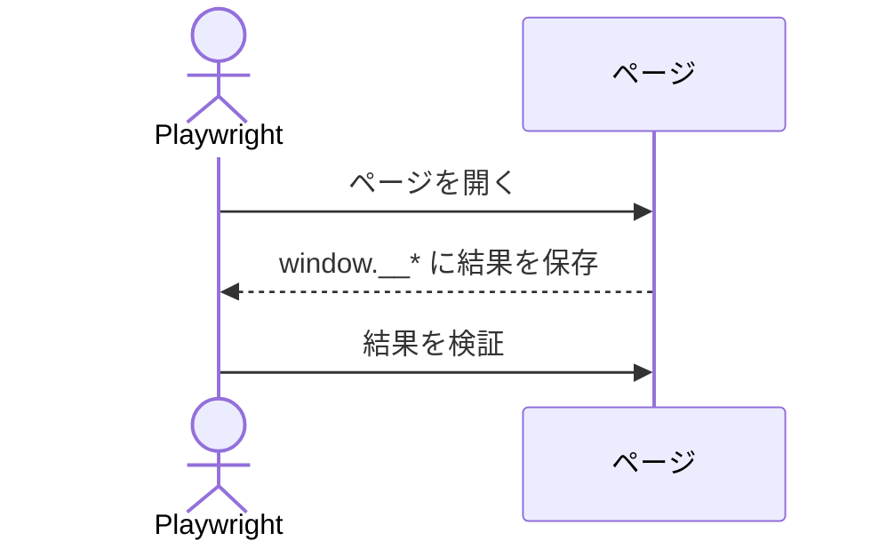

# アーキテクチャ概要（WebGPU 初心者向け）

このドキュメントは、WebGPU を初めて触る人でも流れが追えるように、PoC の全体像と描画の仕組みをやさしく説明する。専門用語は最小限にとどめ、要点を図で示す。

## 全体構成（何がどこにあるか）

- Monorepo 構成で、WebGPU PoC は `apps/egui-web` に集約されている。
- 端末向けの最小 PoC は `apps/tui` に置き、Rust + ratatui で Web 版に触れずに動作確認できる。
- MCP サーバ `apps/mcp-qni` から回路編集と実行を行う。
- Web UI は Rust（egui/eframe）で構築し、Wasm として動く。
- 量子回路は 2 量子ビット固定の PoC で、ゲートは `H/X/Y/Z/√X/S/S†/T/T†` のみ扱う。

## 画面構成（画面に何が出るか）

- `index.html` に `canvas#egui-canvas` を配置し、eframe が描画対象として使う。
- キャンバスはウィンドウサイズに合わせて全画面でリサイズする。
- 画面は「2 本の量子ビット線」「上部のゲートパレット」「配置済みゲート」「状態ベクトルの円表示」で構成する。

## 描画の流れ（ざっくり）

egui/eframe が WebGPU の初期化と描画ループを担当する。ここでは大まかな流れだけ押さえる。

1. Wasm を初期化し、egui アプリを起動する  
2. eframe がキャンバスと WebGPU を接続する  
3. ゲート配置を更新し、状態ベクトルを CPU で計算する  
4. egui の描画指示を作り、wgpu が描画する  

## 描画モデル（CPU と GPU の役割分担）

- CPU（Wasm/Rust 側）は「ゲート配置」「状態ベクトル計算」「描画要素の構築」を担当する。
- GPU（WebGPU/wgpu 側）は「egui が生成した描画コマンドのレンダリング」を担当する。

## 量子計算の流れ（PoC としての最小構成）

- 起動時は `|00>` を初期状態として GPU バッファに書き込む。
- ゲートはパレットからドラッグしてワイヤへ配置する。
- 配置済みゲートを左から順に並べ、ワイヤ番号（0/1）に応じてゲートを適用する。
- 計算は CPU 側（Rust）で行い、結果を egui の描画に反映する。

## 描画ループ（動いているか確認する仕組み）

- eframe が描画ループを管理し、毎フレーム egui を描画する。

## テストの仕組み（Playwright）

- Playwright で「WebGPU が使えること」「ゲートのドラッグが動くこと」「状態ベクトルが期待値になること」を確認する。
- テストはヘッドレスがデフォルト（必要なら `HEADLESS=0` で可視化）。
- `window.__eguiReadStateVector` と `window.__eguiReady` を使い、計算結果や初期化完了を確認する。
- テストで確認する項目は以下。
  - WebGPU が有効であること
  - キャンバスサイズが期待通りであること
  - 初期状態の状態ベクトルが `|00>` であること
  - ゲート配置後の状態ベクトルが期待値になること

## 主要ファイル

- `apps/egui-web/src/lib.rs`: egui UI と状態ベクトル計算
- `apps/egui-web/index.html`: キャンバス配置と Trunk 設定
- `apps/egui-web/bootstrap.js`: Wasm 初期化とテスト用フック
- `apps/egui-web/tests/egui-web.spec.js`: Playwright テスト
- `docs/decisions.md`: PoC の仕様・決定事項
