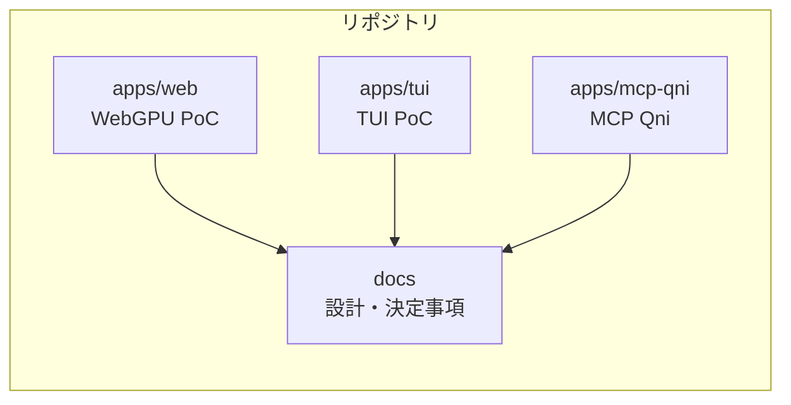
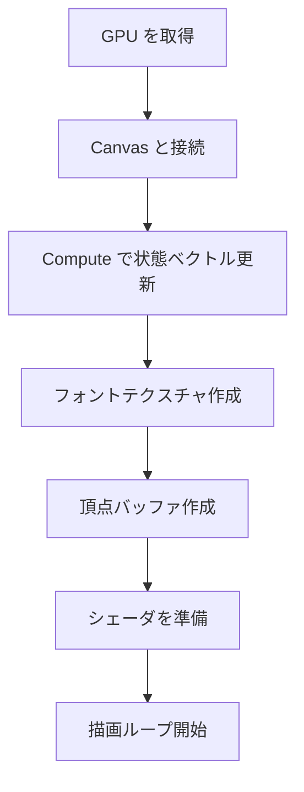
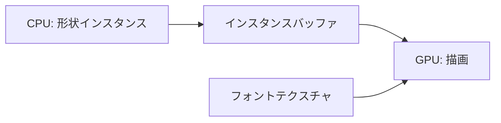
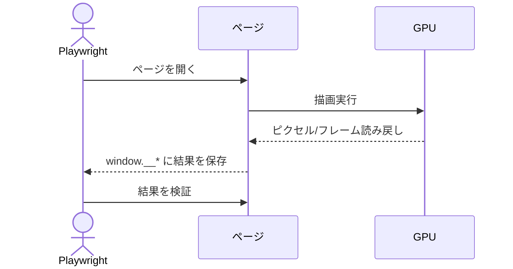

# アーキテクチャ概要（WebGPU 初心者向け）

このドキュメントは、WebGPU を初めて触る人でも流れが追えるように、PoC の全体像と描画の仕組みをやさしく説明する。専門用語は最小限にとどめ、要点を図で示す。

## 全体構成（何がどこにあるか）

- Monorepo 構成で、WebGPU PoC は `apps/web` に集約されている。
- 端末向けの最小 PoC は `apps/tui` に置き、Rust + ratatui で Web 版に触れずに動作確認できる。
- MCP サーバ `apps/mcp-qni` から回路編集と実行を行う。
- UI はフレームワークを使わず、TypeScript + Vite だけで動く。
- 量子回路は 1 量子ビット固定の PoC で、ゲートは `X/H/Y/Z/S/T` のみ扱う。

## 画面構成（画面に何が出るか）

- `index.html` には `#app` だけを置き、起動時に `canvas#gfx` とステータス表示を差し込む。
- キャンバスは固定サイズ `800x600`。
- 描画内容は「1 本線 + ゲート箱 + 状態ベクトル文字列」の最小構成。

## 描画の流れ（ざっくり）

WebGPU では「GPU を使うための準備」を段階的に行う。ここでは難しい単語は気にせず、順番だけ押さえればよい。

1. GPU を使う許可とデバイスを取得する  
2. キャンバスと GPU をつなげる  
3. ゲート計算用のコンピュートシェーダで状態ベクトルを更新する  
4. 文字用のテクスチャ（小さな画像）を用意する  
5. 頂点データ（四角形や線を三角形にしたもの）を GPU に渡す  
6. シェーダ（GPU が動かす小さなプログラム）を準備する  
7. 描画ループで毎フレーム描く  

## 描画モデル（CPU と GPU の役割分担）

- CPU（JavaScript 側）は「四角形や線のインスタンス情報」を作る。
- GPU（WebGPU 側）は「状態ベクトルの更新」と「文字の UV 計算・描画」も担当する。
- 文字は 8x8 の小さなドット画像を 1 枚のテクスチャにまとめておき、GPU 側で文字コードから UV を計算して描画する。

## 量子計算の流れ（PoC としての最小構成）

- 起動時は `|0>` に単一ゲートを適用する。
- ゲートは `?gate=` で切り替えられる（例: `?gate=Y`）。
- 計算は GPU のコンピュートシェーダで行う。通常実行では読み戻しをしない。
- 文字列はゲートごとの固定文字列を使い、読み戻しはテスト時のみ行う。

## 描画ループ（動いているか確認する仕組み）

- `requestAnimationFrame` で毎フレーム描画する。
- 初回フレームだけ GPU から 1 ピクセルを読み戻し、描画ができたかの簡易チェックに使う。
- さらに必要なら、フレーム全体を読み戻して PNG 化できる。

## テストの仕組み（Playwright）

- Playwright で「WebGPU が使えること」と「描画結果が取れること」を確認する。
- テストはヘッドレスがデフォルト（必要なら `HEADLESS=0` で可視化）。
- そのために `window.__*` のデバッグ用フラグを使い、描画完了や読み戻し結果を受け取る。
- テストで確認する項目は以下。
  - WebGPU が有効であること
  - キャンバスサイズが期待通りであること
  - エラーステータスが空であること
  - 描画済みフラグ、頂点数、読み戻しピクセルの値
  - 取得したフレームが PNG データであること

## 主要ファイル

- `apps/web/src/main.ts`: WebGPU 初期化、量子計算、描画バッファ生成、描画ループ
- `apps/web/src/style.css`: ページの基本スタイル
- `apps/web/tests/webgpu.spec.ts`: Playwright テスト
- `docs/decisions.md`: PoC の仕様・決定事項
