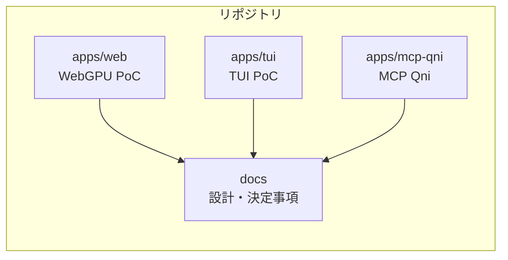
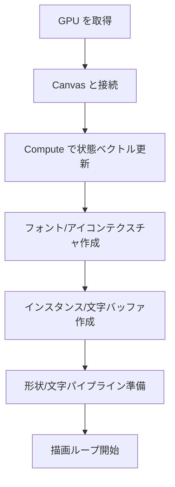
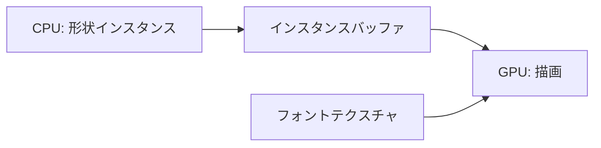
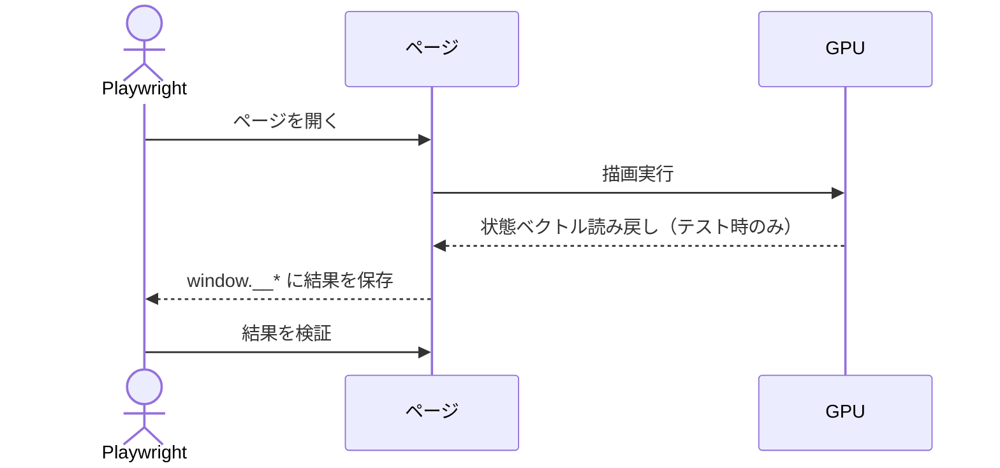

# アーキテクチャ概要（WebGPU 初心者向け）

このドキュメントは、WebGPU を初めて触る人でも流れが追えるように、PoC の全体像と描画の仕組みをやさしく説明する。専門用語は最小限にとどめ、要点を図で示す。

## 全体構成（何がどこにあるか）

- Monorepo 構成で、WebGPU PoC は `apps/web` に集約されている。
- 端末向けの最小 PoC は `apps/tui` に置き、Rust + ratatui で Web 版に触れずに動作確認できる。
- MCP サーバ `apps/mcp-qni` から回路編集と実行を行う。
- UI はフレームワークを使わず、TypeScript + Vite だけで動く。
- 量子回路は 2 量子ビット固定の PoC で、ゲートは `H/X/Y/Z/√X/S/S†/T/T†` のみ扱う。

## 画面構成（画面に何が出るか）

- `index.html` には `#app` だけを置き、起動時に `canvas#gfx` とステータス表示を差し込む。
- キャンバスはウィンドウサイズに合わせて全画面でリサイズする。
- 画面は「2 本の量子ビット線」「上部のゲートパレット」「配置済みゲート」「状態ベクトルカード」で構成する。

## 描画の流れ（ざっくり）

WebGPU では「GPU を使うための準備」を段階的に行う。ここでは難しい単語は気にせず、順番だけ押さえればよい。

1. GPU を使う許可とデバイスを取得する  
2. キャンバスと GPU をつなげる  
3. 状態ベクトル用バッファを初期化し、必要なら読み戻す  
4. フォント用テクスチャ（8x8 の文字）とゲートアイコン用テクスチャ（PNG）を用意する  
5. 形状（線・角丸矩形）と文字描画用のパイプラインを用意する  
6. 画面構成からインスタンスバッファと文字バッファを更新する  
7. 描画ループで毎フレーム描く  

## 描画モデル（CPU と GPU の役割分担）

- CPU（JavaScript 側）は「画面レイアウト（線・矩形）」「文字の配置」「ドラッグ入力」を担当する。
- GPU（WebGPU 側）は「状態ベクトルの更新（コンピュート）」と「形状/文字の描画（レンダー）」を担当する。
- 文字は 8x8 のフォントアトラス、ゲートアイコンは PNG を集めたアトラスを使い、GPU 側で文字コードから UV を計算して描画する。

## 量子計算の流れ（PoC としての最小構成）

- 起動時は `|00>` を初期状態として GPU バッファに書き込む。
- ゲートはパレットからドラッグしてワイヤへ配置する。
- 配置済みゲートを左から順に並べ、ワイヤ番号（0/1）に応じてゲートを適用する。
- 計算は GPU のコンピュートシェーダで行い、状態ベクトル文字列も GPU 側でグリフ変換して表示する。

## 描画ループ（動いているか確認する仕組み）

- `requestAnimationFrame` で毎フレーム描画する。
- 初回フレームで `window.__renderDone` を立て、Playwright の待ち合わせに使う。

## テストの仕組み（Playwright）

- Playwright で「WebGPU が使えること」「ゲートのドラッグが動くこと」「状態ベクトルが期待値になること」を確認する。
- テストはヘッドレスがデフォルト（必要なら `HEADLESS=0` で可視化）。
- `window.__captureStateVector` と `window.__renderDone` を使い、描画完了や読み戻し結果を受け取る。
- テストで確認する項目は以下。
  - WebGPU が有効であること
  - キャンバスサイズが期待通りであること
  - エラーステータスが空であること
  - 描画済みフラグと頂点数
  - 読み戻した状態ベクトルの値

## 主要ファイル

- `apps/web/src/main.ts`: WebGPU 初期化、量子計算、入力/描画ループ
- `apps/web/src/gpu/compute.ts`: ゲート適用のコンピュートシェーダ実行
- `apps/web/src/renderer/renderer.ts`: 形状/文字描画のレンダラー
- `apps/web/src/ui/layout.ts`: 画面レイアウトとインスタンス生成
- `apps/web/tests/webgpu.spec.ts`: Playwright テスト
- `docs/decisions.md`: PoC の仕様・決定事項
