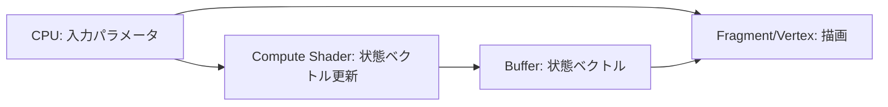

# GPU 化プラン（回路シミュレーション + 描画）

目的: CPU 側の処理を最小化し、回路シミュレーションと描画の両方を GPU に寄せる。

## 現状のボトルネック（CPU 依存）

- ゲート行列の準備と配置順の解決が CPU 実行
- 頂点生成（線・矩形・文字）が CPU 実行
- フォントアトラス生成が CPU 実行
- テキストレイアウトを CPU が計算して頂点化

## 目標の構成

- 回路シミュレーション: WebGPU のコンピュートシェーダで状態ベクトルを更新
- 描画: できるだけ GPU 側で手続きを閉じる
  - 文字描画は GPU でテクスチャ参照のみ
  - 状態ベクトルは CPU 側で円インスタンスを組み立てて GPU に渡し、GPU が描画する
  - 直線や矩形は GPU 側でインスタンス化し、CPU の頂点展開を削減

## 段階的な移行ステップ

### Step 1: 状態ベクトルを GPU で計算（実装済み）

- CPU 側でゲート配置から `GateParams`（2x2 行列 + target bit + control 情報）を組み立て、Compute Shader に渡す。
- 入力バッファ: ゲート行列、ターゲット bit、制御ビット情報、初期状態。
- 出力バッファ: 更新後の状態ベクトル（最大 16 qubit）。
- CPU は計算せず、結果は GPU バッファのまま描画側に渡す（読み戻しはテスト時のみ）。

実装メモ:
- `H/X/Y/Z/√X/S/S†/T/T†/P/Rx/Ry/Rz` は CPU 側で 2x2 複素行列へ展開して `GateParams` に詰める。
- Control は同じ列の非 control ゲートへ `control_mask` / `control_value` として反映する。
- Compute で状態ベクトルを更新し、CPU 側で用意した円インスタンスを使って GPU が描画する（読み戻しはテスト時のみ）。

検証:
- Playwright で GPU 計算出力が期待値と一致することを読み戻しで確認（テスト時のみ読み戻し）。
- 単一ゲートに加えて、control + X を同じ列に置く CNOT 相当のケースも Playwright で検証する。

### Step 2: 描画用ジオメトリの GPU 化

- CPU 側の `egui::Painter` ベースの線・矩形描画を「インスタンス情報」に置き換える。
- GPU 側で頂点を組み立てる（フルスクリーン四角形 + インスタンス展開）。
- CPU はインスタンス配列のみを作る（位置、サイズ、色、タイプ）。

現状メモ:
- 現在の `apps/egui-web/src/lib.rs` では回路線・ゲート枠・ラベルの多くをまだ egui painter で描いている。
- 状態ベクトル円は GPU コールバック経由で描画しているが、回路図全体の GPU 化は未完了。

検証:
- 画面の線・ゲート箱が従来の位置で描画されること。

### Step 3: 文字描画と状態表示の最小 CPU 化

- CPU は「文字コード列」と「描画開始座標」だけを渡す。
- GPU 側で文字コードを参照して UV を計算するシェーダに移行する。
- 可能なら、テキスト全体を 1 つの GPU パスで描く。

現状メモ:
- 状態ベクトルは GPU で描画しているが、円インスタンス自体は現在 CPU 側で生成・キャッシュしている。
- 一方でゲートラベルや UI テキストはまだ egui 側描画が主体で、GPU への全面移行は今後の課題。

検証:
- 状態ベクトル円が期待通りに表示されること。

### Step 4: GPU パイプライン統合

- 回路図と文字描画を 1〜2 パスに集約。
- Compute → Render の同期は 1 フレーム内に閉じる。

検証:
- 現行の Playwright テストに加え、描画の安定性とフレーム更新を確認。

## データ設計（例）

- `GateParams` バッファ
  - `m00/m01/m10/m11: vec2<f32>`（複素 2x2 行列）
  - `bit: u32`
  - `state_count: u32`
  - `control_mask: u32`
  - `control_value: u32`
- `StateVector` バッファ
  - 複素振幅列（`vec2<f32>` の配列）
- `DrawInstances` バッファ
  - `type: u32`（line/rect/text）
  - `pos: vec2<f32>`
  - `size: vec2<f32>`
  - `color: vec4<f32>`
  - `textIndex: u32`（文字描画用）

## テスト戦略（TDD 前提）

- 先に Playwright テストを拡張して GPU 計算結果を検証する。
- 現在のテストフックである `window.__eguiReadStateVector` と `window.__eguiReady` を使って、段階的に GPU 側の責務を増やしていく。
- 各ステップの完了条件をテストで固定し、後戻りしない。

## 想定リスク

- Compute Shader と Render Pipeline の同期設計
- 小規模 PoC でも GPU への過剰転送で逆に遅くなる可能性
- デバッグの難易度上昇（GPU 内の値の観測）
