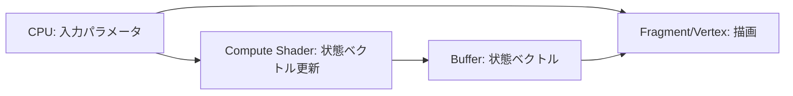

# GPU 化プラン（回路シミュレーション + 描画）

目的: CPU 側の処理を最小化し、回路シミュレーションと描画の両方を GPU に寄せる。

## 現状のボトルネック（CPU 依存）

- ゲート適用（`applyGateToZero`）が CPU 実行
- 頂点生成（線・矩形・文字）が CPU 実行
- フォントアトラス生成が CPU 実行
- テキストレイアウトを CPU が計算して頂点化

## 目標の構成

- 回路シミュレーション: WebGPU のコンピュートシェーダで状態ベクトルを更新
- 描画: できるだけ GPU 側で手続きを閉じる
  - 文字描画は GPU でテクスチャ参照のみ（CPU は文字列→コード列の転送程度）
  - 直線や矩形は GPU 側でインスタンス化し、CPU の頂点展開を削減

## 段階的な移行ステップ

### Step 1: 状態ベクトルを GPU で計算（実装済み）

- 現状の `applyGateToZero` を置き換え、Compute Shader を追加する。
- 入力バッファ: ゲート種別（`X/H/Y/Z/S/T`）、初期状態、1 量子ビット分の状態ベクトル。
- 出力バッファ: 更新後の状態ベクトル。
- CPU は計算せず、結果は GPU バッファから取得し描画側に渡す。

実装メモ:
- ゲート種別は `X=0, H=1, Y=2, Z=3, S=4, T=5` の順でエンコード。
- Compute → Readback → 文字列化の順で UI に反映。

検証:
- Playwright で各ゲートの GPU 計算出力が期待値と一致することを読み戻しで確認（テスト時のみ読み戻し）。
- 2025-09-09: Playwright で X/H/Y/Z/S/T の描画と GPU 計算読み戻しが通過（xvfb-run で確認）。

### Step 2: 描画用ジオメトリの GPU 化

- CPU 側の `addQuad/addRect/addLine` を「インスタンス情報」に置き換える。
- GPU 側で頂点を組み立てる（フルスクリーン四角形 + インスタンス展開）。
- CPU はインスタンス配列のみを作る（位置、サイズ、色、タイプ）。

実装メモ:
- 線/矩形はインスタンス描画に移行し、頂点シェーダで quad を生成するように変更済み。

検証:
- 画面の線・ゲート箱が従来の位置で描画されること。

### Step 3: 文字描画の最小 CPU 化

- CPU は「文字コード列」と「描画開始座標」だけを渡す。
- GPU 側で文字コードを参照して UV を計算するシェーダに移行する。
- 可能なら、テキスト全体を 1 つの GPU パスで描く。

実装メモ:
- 状態ベクトル文字列とゲートラベルは GPU 側で UV/配置を計算するように変更済み。

検証:
- 状態ベクトル文字列が期待通りに表示されること。

### Step 4: GPU パイプライン統合

- 回路図と文字描画を 1〜2 パスに集約。
- Compute → Render の同期は 1 フレーム内に閉じる。

検証:
- 現行の Playwright テストに加え、描画の安定性とフレーム更新を確認。

## データ設計（例）

- `GateParams` バッファ
  - `gateType: u32`（`X=0, H=1, ...`）
  - `qubits: u32`（PoC は 1 固定）
- `StateVector` バッファ
  - 2 要素の複素数（`vec2<f32>` x2）
- `DrawInstances` バッファ
  - `type: u32`（line/rect/text）
  - `pos: vec2<f32>`
  - `size: vec2<f32>`
  - `color: vec4<f32>`
  - `textIndex: u32`（文字描画用）

## テスト戦略（TDD 前提）

- 先に Playwright テストを拡張して GPU 計算結果を検証する。
- 既存の `__debugPixel` / `__frameDataUrl` を維持しつつ、段階的に参照先を GPU に移す。
- 各ステップの完了条件をテストで固定し、後戻りしない。

## 想定リスク

- Compute Shader と Render Pipeline の同期設計
- 小規模 PoC でも GPU への過剰転送で逆に遅くなる可能性
- デバッグの難易度上昇（GPU 内の値の観測）
