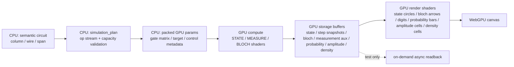

# GPU 化プラン（回路シミュレーション + 描画）

目的: Web 版の量子状態シミュレーションと状態表示を GPU に常駐させ、production 経路で GPU → CPU readback を発生させない。

## 現在の方針

- 量子状態の更新は WebGPU compute shader のみで行う。
- CPU は state vector / 密度行列 / 測定確率 / ブロッホベクトルを計算しない。
- CPU は semantic circuit から GPU dispatch 用の plan / params を作るだけ。
- 状態ベクトル円、ブロッホ球表示、測定値、確率表示、振幅表示、密度行列表示は GPU storage バッファを描画シェーダが直接 sample する。
- `read_state_vector` / `read_bloch_vectors` / `read_measurement_outcomes` / `read_probability_distributions` / `read_amplitude_cell` / `read_density_matrix_cell` は Playwright などテスト用の on-demand readback。production 描画経路では使わない。

## 現在のデータフロー

## 実装済みの GPU 常駐部分

### State vector recompute

- `simulation_plan/*` が配置済みゲートを `SimulationOp` に linearize する。
- `gpu/recompute.rs` が op stream を variant ごとに pack し、1 つの command encoder に compute dispatch をまとめる。
- 初期化は encoder 内で `clear_buffer` + 8 byte copy。CPU 側で state vector を作って upload しない。
- `STATE_COMPUTE_SHADER` が unitary / write gate を ping-pong state buffer に適用する。

### Measurement

- `MEASURE_REDUCE_SHADER` が `pZero` を GPU reduction し、gate id ベースの決定論的 RNG で測定結果を sample する。
- `MEASURE_COLLAPSE_SHADER` が選ばれた基底へ射影し、GPU 上で正規化する。
- 測定結果は `measurement_aux_buffer` に残り、`MEASUREMENT_DIGIT_SHADER` が直接 sample して 0/1 を描画する。

### ブロッホ球表示ブロック

- `BLOCH_REDUCE_SHADER` が state buffer から量子ビットごとのブロッホベクトルを計算する。
- `BLOCH_OVERLAY_SHADER` が `bloch_output_buffer` を直接 sample し、矢印と tip dot を描く。
- Bell など maximally mixed な局所状態のゼロベクトル表示も shader-side の値で決まる。

### 確率・振幅・密度行列表示ブロック

- `PROBABILITY_REDUCE_SHADER` が表示対象 span の周辺確率を GPU 上で集計し、`PROBABILITY_RENDER_SHADER` が棒を描画する。
- `AMPLITUDE_CAPTURE_SHADER` が表示対象 span の複素振幅と混合状態用の大きさを GPU バッファへ保存し、`AMPLITUDE_RENDER_SHADER` が円盤・輪郭・位相針を描画する。
- `DENSITY_CAPTURE_SHADER` が Quirk 互換の `Density`〜`Density8` 用に縮約密度行列を GPU 上で計算し、`DENSITY_RENDER_SHADER` が同じ storage バッファを直接読んでセルを描画する。
- 外部 GPU 実行では Qiskit backend が Probability / Amplitude / Bloch / Density Matrix の表示値を返し、Web 側は対応する GPU storage バッファへ一括転送する。転送後の描画はローカル実行と同じ render shader が担当し、本番経路で読み戻しはしない。Control と同じ列に置いた Density Matrix 表示ブロックは、外部契約の `control_mask` / `control_value` で条件付き表示として抽出する。
- CPU は表示値、測定確率、ブロッホベクトル、密度行列要素を計算しない。ホバー中のセル番号など、描画値ではない幾何情報だけを渡す。

### State-vector panel

- `StateVectorCallback` が render params（viewport / panel origin / cell pitch / colors など）だけを渡す。
- 状態円の振幅・位相・確率表現は GPU shader が state バッファを直接参照して描く。
- CPU は per-cell probability / phase / ブロッホ値を作らない。
- 回路列の hover / breakpoint 用プレビューは qni と同じく step ごとの結果をキャッシュする。ただし qni の worker CPU キャッシュではなく、WebGPU の `state_snapshot_cache_buffer` に列ごとの state バッファを copy して保持する。hover 中は該当 slot を `state_preview_buffer` へ GPU copy するだけで、compute shader は再実行しない。疎な URL 入力で巨大な空列キャッシュを作らないよう、snapshot slot は `MAX_STEP_SNAPSHOT_SLOTS` で明示的に上限管理する。

## CPU に残す処理

- egui input / pointer handling / drag/drop state machine。
- semantic circuit model の更新、URL codec、capacity validation。
- `GateParams` の係数生成（ゲート行列、target bit、control mask/value）。これは状態値の計算ではなく dispatch metadata の準備。
- 回路線、ゲート枠、ラベル、パレット、通常 UI テキストの egui painter 描画。
- テスト専用 readback の staging buffer 管理。

## 今後の改善候補

### 1. 回路図ジオメトリの GPU 化

- 現状: 回路線・ゲート枠・ラベルの多くは egui painter が描く。
- 候補: line / rect / glyph instance バッファを作り、GPU render pass へ寄せる。
- 注意: UI テキストや hit-test は egui と密接なので、全面移行より hot path から段階的に行う。

### 2. Dynamic GPU capacity

- 現状: `MAX_OPS_PER_RECOMPUTE` / `MAX_BLOCH_SLOTS` / `MAX_MEASUREMENT_SLOTS` を capacity validation で守る。
- 候補: 回路規模に応じて storage / staging バッファを grow する。
- 注意: release build で silent skip しない。capacity 超過は明示エラーか buffer resize にする。

### 3. Debug / profiling

- 現状: FPS HUD と Playwright readback tests で機能確認。
- 候補: 深い回路（30+ gates）の recompute benchmark を追加し、single-submit / staging copy の効果を測る。
- 注意: small Playwright tests は browser startup ノイズが大きく、GPU dispatch 改善を検出しにくい。

## テスト戦略

- Playwright は test-only readback API で state vector / Bloch / measurement 測定結果 / Probability / Amplitude / Density Matrix を検証する。
- Production path の正しさは、readback ではなく描画シェーダが同じ GPU storage バッファを直接 sample する構造で担保する。
- UI 変更時は visual / drag specs を通し、GPU path 変更時は `web-gpu.spec.ts` と state semantics specs を通す。
- repo root の `./scripts/check-all.sh` を最終 gate とする。

## リスク

- Compute → render の同期や active ping-pong buffer の取り違え。
- GPU buffer capacity と op stream の不一致。
- test-only readback を production render path に混ぜてしまうこと。
- egui painter と GPU callback の z-order / clip rect の不整合。
