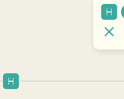
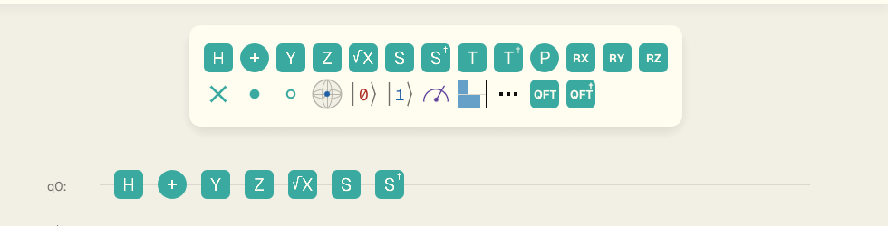

# ゲートアイコン描画方式の判断

## 結論

推奨は **案 C: ビルド時に SVG から 128×128 px PNG を焼き付け、Rust では PNG のアルファだけを RLE 化してテクスチャ化する方式**。

理由は次の通り。

- パレットと回路で同じ高解像度ラスタ画像を縮小サンプリングするため、サブピクセル位置差で H / X / Y / Z / √X / S / S† の太さが変わらない。
- `assets/icons/*.svg` を正にしたまま、TypeScript 側は SVG、Rust 側は同じ SVG から生成した PNG を使える。
- 実行時の SVG パーサ、PNG デコーダ、フォント抽出器を wasm に入れないため、wasm サイズが最小。
- 曲線を含む S / T / R / P なども、生成時に SVG から PNG 化するだけで対応できる。

## 実測条件

| 項目 | 値 |
| --- | ---: |
| 基準コマンド | `pnpm -C apps/egui-web exec trunk build --release` |
| 基準 wasm | `apps/egui-web/dist/qni-egui-web_bg.wasm` |
| 自作 SVG パーサ基準 | 8,108,489 bytes |
| 画面確認 | `http://127.0.0.1:4180/#%7B%22cols%22%3A%5B%5B%22H%22%5D%2C%5B%22X%22%5D%2C%5B%22Y%22%5D%2C%5B%22Z%22%5D%2C%5B%22X%5E%C2%BD%22%5D%2C%5B%22S%22%5D%2C%5B%22S%E2%80%A0%22%5D%5D%7D` |
| After スクリーンショット | `h-palette-vs-circuit.png` |

## 比較表

| 案 | 試作内容 | 描画品質 | wasm サイズ | 曲線グリフ追加 | 1 ソース原則 | ビルド / 開発体験 | 判断 |
| --- | --- | --- | ---: | --- | --- | --- | --- |
| A: `ttf-parser` でフォントから直接抽出 | `/tmp/qni-icon-a` で `ttf-parser = 0.25.1` を使い、Geist から輪郭を取り出してメッシュ描画 | H は描画できたが、最終描画はメッシュのまま。フォントヒンティング相当が無く、根本原因のサブピクセル細りを解かない | 8,349,058 bytes（+240,569） | フォント由来なので輪郭取得は容易。ただし塗りつぶし用の三角形分割は残る | Rust はフォント直、TypeScript は SVG になり、共有アセットの正が分かれる | 実行時コードが増える。Geist フォント依存が描画経路に残る | 不採用 |
| B: `resvg` + 高解像度ラスタ化 | `resvg = 0.47.0`、`default-features = false` で初回描画時に SVG を 128×128 px テクスチャ化 | 高解像度テクスチャなので品質は案 C と同等 | 8,989,134 bytes（+880,645） | SVG を足すだけ | 維持できる | 実行時に SVG 解析器とラスタ化器を wasm に含める。サイズ増が大きい | 不採用 |
| C: SVG → PNG 焼き付け | `scripts/extract-gate-svg.py` が SVG と PNG を生成。`build.rs` が PNG アルファを RLE 化し、初回描画時に egui テクスチャ化 | Playwright 実測でパレット / 回路の H, X, Y, Z, √X, S, S† が一致（内側の白画素: H 44 px、X 36 px、Y 34 px、Z 35 px、√X 63 px、S 44 px、S† 52 px） | 8,110,661 bytes（+2,172） | SVG 生成後に PNG も生成されるため追加実装ほぼなし | 維持できる。SVG が正、PNG は派生物 | `rsvg-convert` または `magick` が再生成時だけ必要。通常ビルドは Rust の `png` ビルド時依存だけ | 採用 |

## 採用しなかった案

### 案 A

`ttf-parser` 自体は軽く、曲線輪郭の取得もできる。しかし最後は `egui::Mesh` で塗るため、今回の主因である「頂点が小数ピクセルに落ちたときの見かけの細り」は残る。さらに TypeScript 側は SVG、Rust 側はフォント直になり、`assets/icons/*.svg` を唯一の正にする方針から外れる。

### 案 B

品質と 1 ソース原則は満たす。ただし `resvg` / `usvg` / `tiny-skia` を実行時 wasm に含めるため、今回の実測では +880,645 bytes になった。対象が 32 px の単色ゲート文字であることを考えると、実行時 SVG 解析は重い。

## 採用実装

- `scripts/extract-gate-svg.py`
  - Geist から `h.svg`, `x.svg`, `y.svg`, `z.svg`, `plus.svg`, `sqrtx.svg`, `s.svg`, `sdagger.svg` を生成。
  - 同じ SVG から `rsvg-convert`（無ければ `magick`）で 128×128 px PNG も生成。
- `apps/egui-web/build.rs`
  - `assets/icons/*.png` をビルド時に読み、128×128 px RGBA であることと可視画素があることを検査。
  - アルファだけを RLE 配列へ変換。
  - 実行時 wasm には PNG デコーダを含めない。
- `apps/egui-web/src/icons/svg_icon.rs`
  - RLE アルファを `ColorImage` に展開し、初回描画時だけ `TextureHandle` を作る。
  - `Shape::image` の tint で既存の `colors.label` を掛ける。
- `apps/egui-web/src/icons/gate_glyphs.rs`
  - H / Y / Z / √X / S / S† / X（本体は Plus）を新方式へ切り替え。
  - 旧自作 SVG パーサと ear-clip コードは削除。

## スクリーンショット

### Before

### After

## 検証結果

| 検証 | 結果 |
| --- | --- |
| `cargo check --manifest-path apps/egui-web/Cargo.toml --target wasm32-unknown-unknown` | 通過 |
| `cargo fmt --manifest-path apps/egui-web/Cargo.toml --check` | 通過 |
| `cargo clippy --manifest-path apps/egui-web/Cargo.toml --target wasm32-unknown-unknown --all-targets -- -D warnings` | 通過 |
| `pnpm -C apps/egui-web exec tsc --noEmit` | 通過 |
| `python3 -m py_compile scripts/extract-gate-svg.py` | 通過 |
| `QNI_EGUI_WEB_EXTERNAL_SERVER=1 QNI_EGUI_WEB_BASE_URL=http://127.0.0.1:4180 pnpm -C apps/egui-web exec playwright test tests/egui-web-palette-visual.spec.ts --grep "PNG raster H, X, Y, Z, √X, S and S†" --workers=1` | 通過 |
