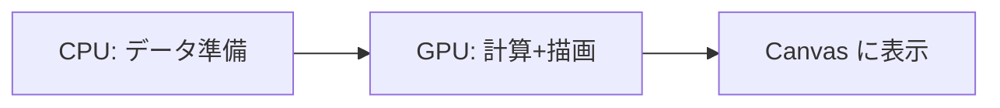
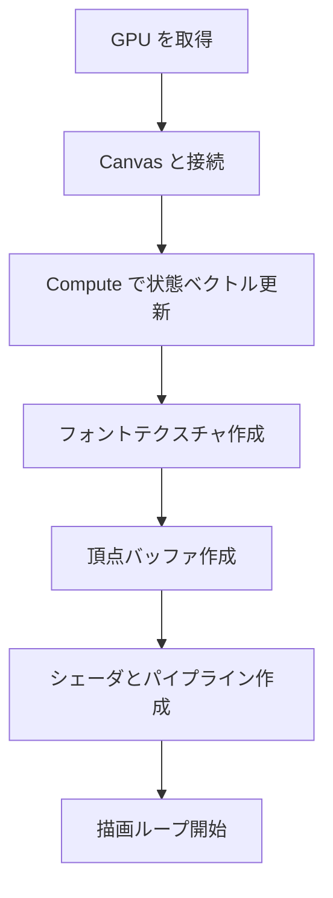
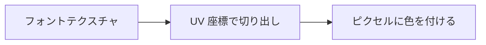

# WebGPU 用語とこの実装の読み方（初心者向け）

このドキュメントは、WebGPU の基本用語と「この PoC が何をしているか」をやさしく説明する。

## ざっくり全体像

WebGPU は「CPU で準備 → GPU で描画」の流れで動く。  
この PoC では、CPU が図形や文字のデータを作り、GPU が状態ベクトル計算と描画を担当する。

## よく出てくる用語

### GPU / CPU

- CPU は「計算と準備をする係」。
- GPU は「大量のピクセルや図形を高速に描く係」。

### Adapter / Device

- Adapter は「利用可能な GPU の候補」。
- Device は「実際に使う GPU デバイス」。
- `navigator.gpu.requestAdapter()` → `adapter.requestDevice()` の順で取得する。

### Canvas / Context

- Canvas は表示領域。
- Context は「Canvas と GPU をつなぐ窓口」。
- `canvas.getContext('webgpu')` で取得する。

### Shader（シェーダ）

- GPU で動く小さなプログラム。
- この PoC は WGSL で書いたシェーダを使う。
- 役割は 3 つ:
  - Vertex Shader: 頂点の位置を画面座標に変換
  - Fragment Shader: 1 ピクセルの色を決める
  - Compute Shader: 状態ベクトルを更新

### Pipeline（パイプライン）

- 「どのシェーダを使うか」「どんな頂点データか」をまとめた設定。
- GPU はパイプラインに沿って描画する。

### Buffer（バッファ）

- GPU に渡すデータ箱。
- この PoC では主に以下を使う:
  - Vertex Buffer: 三角形の頂点データ
  - Uniform Buffer: 画面サイズなどの固定値
  - Storage Buffer: 状態ベクトルの入出力

### Texture（テクスチャ）

- GPU が参照できる画像データ。
- この PoC では「文字を描くための小さなフォント画像」をテクスチャにしている。

### Sampler（サンプラ）

- テクスチャの参照方法（拡大・縮小時の補間方法）を決める設定。
- ここでは `nearest` を使い、ドット文字をにじませず表示する。

### Bind Group（バインドグループ）

- シェーダが使うバッファやテクスチャをまとめて登録する仕組み。
- 「このシェーダはこのバッファとテクスチャを使う」と伝える。

## この PoC での流れ（やっていること）

1. GPU を取得して Canvas と接続する  
2. Compute Shader で状態ベクトルを更新する  
3. フォントテクスチャを作る（8x8 のドット文字）  
4. 図形はインスタンス情報として渡し、GPU 側で quad を生成する  
5. シェーダを用意してパイプラインを作る  
6. 描画ループでフレームごとに描く  

## テクスチャと文字のしくみ（この実装の要点）

- 文字は 8x8 のドット絵として用意する。
- すべての文字を 1 枚の画像（フォントテクスチャ）にまとめる。
- 描画時は GPU 側で「文字コード → UV 座標」を計算して切り出す。

## この実装での対応表

| 目的 | WebGPU の要素 | 実装側の場所 |
| --- | --- | --- |
| GPU を取得する | Adapter / Device | `apps/web/src/main.ts` |
| Canvas と接続する | Context | `apps/web/src/main.ts` |
| 状態ベクトルを更新する | Compute Pipeline / Storage Buffer | `apps/web/src/main.ts` |
| 文字用画像を作る | Texture / Sampler | `apps/web/src/main.ts` |
| 形を描く | インスタンスバッファ | `apps/web/src/main.ts` |
| 描画手順を決める | Pipeline | `apps/web/src/main.ts` |

## よくある疑問

### Q. テクスチャって何のために使う？

A. 文字の「絵」を GPU に渡すために使っている。  
テクスチャがあると、GPU が文字の見た目を高速に貼り付けられる。

### Q. なぜ三角形に分解するの？

A. GPU は基本的に三角形を描くのが得意。  
四角形や線も最終的には三角形の組み合わせで描いている。

### Q. どうやって文字を描くの？

A. 文字コードから GPU が UV 座標を計算し、  
その部分の色を使ってピクセルを描く。
### Readback（読み戻し）

- GPU の計算結果を CPU へ戻す操作。
- この PoC では検証用にのみ状態ベクトルとピクセルを読み戻す。
